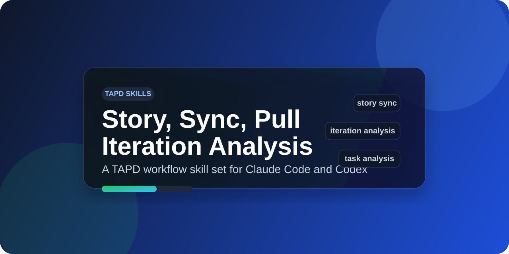

# TAPD Skills

<p align="center">
  
</p>

面向 TAPD 需求协作的一组 agent skills，覆盖需求创建、需求同步、需求拉取、任务分析和迭代分析。

<p align="center">
  <a href="./index.json"></a>
  <a href="https://github.com/vercel-labs/skills"></a>
  <a href="https://www.npmjs.com/package/@huangqz/tapd-cli"></a>
  
  
</p>

<p align="center">
  <strong>为 TAPD 需求协作设计的项目级技能集</strong><br />
  适合用在需求创建、Markdown 同步、需求拉取、任务分析和迭代分析场景。
</p>

> 这组 skills 的目标很直接：让 agent 在执行 TAPD 操作时，不再临时拼命令，而是沿着稳定、可复用的步骤工作。

## 适合什么场景

- 从本地 Markdown 创建 TAPD 需求
- 把 TAPD 需求拉回本地继续维护
- 将本地需求文档持续同步回 TAPD
- 分析单个需求下的任务分布、排期和风险
- 分析迭代整体推进情况
- 盘点某个迭代下的需求状态和推进重点

## Tags

`tapd` `story` `iteration` `project-management` `markdown-sync` `task-analysis` `agent-skill`

## Quick Start

```bash
# 查看仓库里的 skills
npx skills add qizhi2design-svg/tapd-skills --list

# 安装到 Claude Code
npx skills add qizhi2design-svg/tapd-skills -a claude-code -s '*' -y

# 安装到 Codex
npx skills add qizhi2design-svg/tapd-skills -a codex -s '*' -y
```

## Installation

通过 `npx skills add` 安装 TAPD skills。

### Source Formats

```bash
# GitHub shorthand
npx skills add qizhi2design-svg/tapd-skills

# Full GitHub URL
npx skills add https://github.com/qizhi2design-svg/tapd-skills

# Local path
npx skills add ./skills
```

### Install by Agent

安装到 Claude Code：

```bash
npx skills add qizhi2design-svg/tapd-skills -a claude-code -s '*' -y
```

安装到 Codex：

```bash
npx skills add qizhi2design-svg/tapd-skills -a codex -s '*' -y
```

安装到多个 agent：

```bash
npx skills add qizhi2design-svg/tapd-skills -a claude-code codex -s '*' -y
```

只安装单个 skill 到 Claude Code：

```bash
npx skills add qizhi2design-svg/tapd-skills -a claude-code --skill tapd-story-sync -y
```

全局安装到 Claude Code：

```bash
npx skills add qizhi2design-svg/tapd-skills -g -a claude-code -s '*' -y
```

### Common Options

| Option | Description |
| --- | --- |
| `-g, --global` | 安装到用户目录，而不是当前项目 |
| `-a, --agent <agents...>` | 指定 agent，例如 `claude-code`、`codex` |
| `-s, --skill <skills...>` | 只安装指定 skill，`'*'` 表示全部 |
| `-l, --list` | 仅列出可安装 skills，不执行安装 |
| `-y, --yes` | 跳过确认，适合非交互执行 |

### More Examples

```bash
# 通过完整 GitHub URL 安装
npx skills add https://github.com/qizhi2design-svg/tapd-skills -a claude-code -s '*' -y

# 从本地目录安装到 Codex
npx skills add ./skills -a codex -s '*' -y
```

### Installation Scope

| Scope | Flag | Location | Use Case |
| --- | --- | --- | --- |
| Project (default) | - | `./<agent>/skills/` | 跟随项目，适合团队共享 |
| Global | `-g` | `~/<agent>/skills/` | 跨项目复用 |

## Included Skills

### `tapd-story-create`

从本地 Markdown 创建 TAPD 需求。  
适合新建需求、上传 PRD、把文档落到 TAPD。

**Tags:** `story` `create` `markdown`

### `tapd-story-pull`

把 TAPD 需求拉取为本地 Markdown。  
适合继续编辑已有需求、下载需求、同步图片到本地。

**Tags:** `story` `pull` `markdown`

### `tapd-story-sync`

把本地 Markdown 需求同步回 TAPD。  
适合同步正文、Mermaid 图片和本地图片资源。

**Tags:** `story` `sync` `markdown`

### `tapd-story-tasks-analysis`

分析单个需求下的任务情况。  
适合看排期、负责人、工时、联调和测试风险。

**Tags:** `story` `tasks` `analysis`

### `tapd-iteration-analysis`

分析迭代整体推进情况。  
适合周报、复盘和节奏风险分析。

**Tags:** `iteration` `analysis` `project-management`

### `tapd-iteration-stories-analysis`

分析迭代下的需求分布和推进重点。  
适合盘点需求、看状态分布、识别重点需求。

**Tags:** `iteration` `stories` `analysis`

